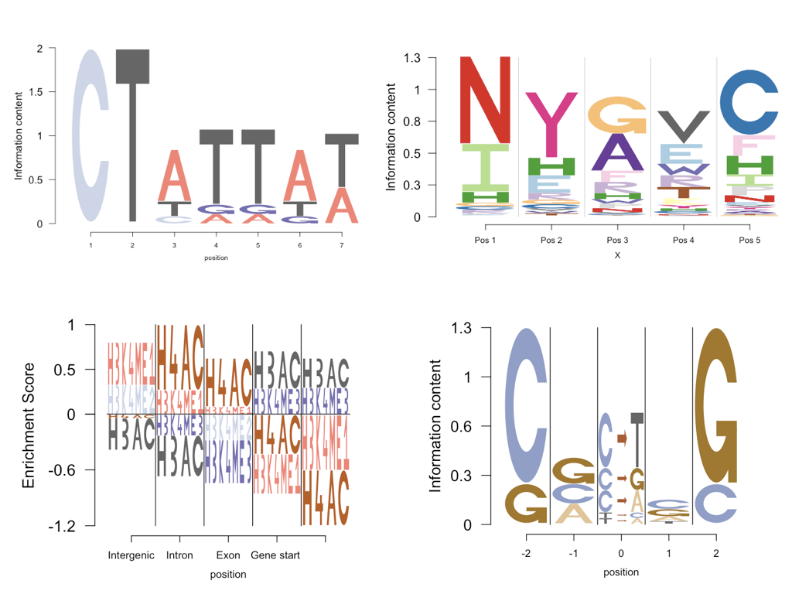
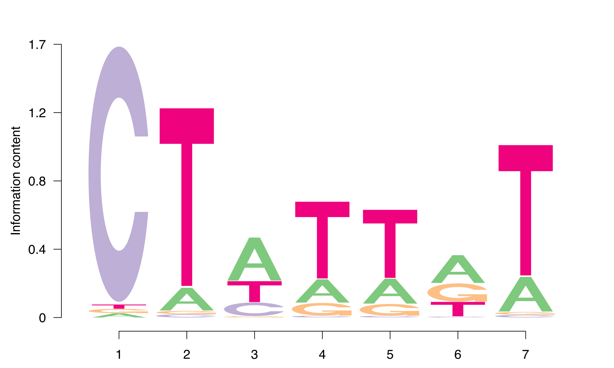
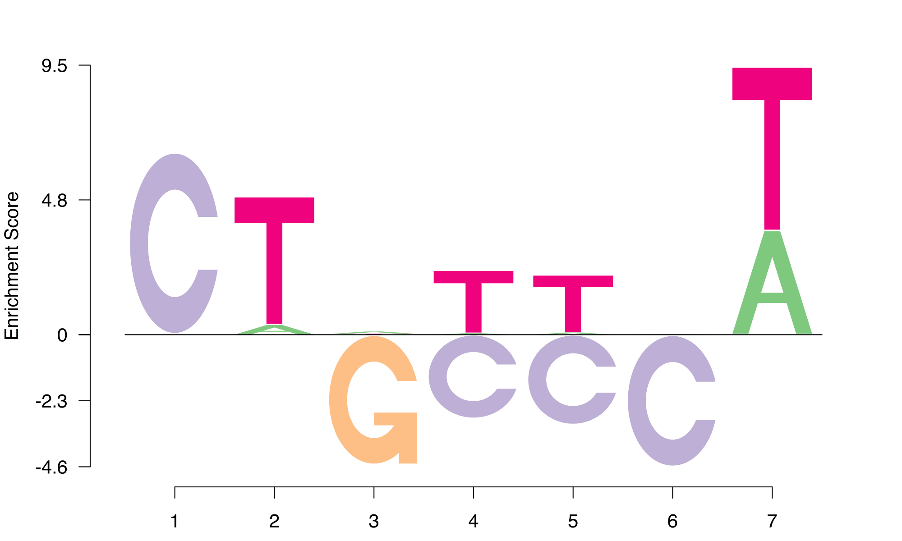
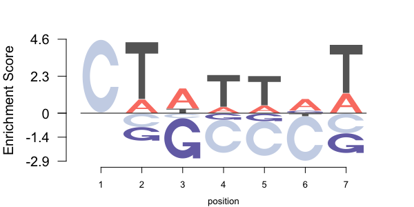
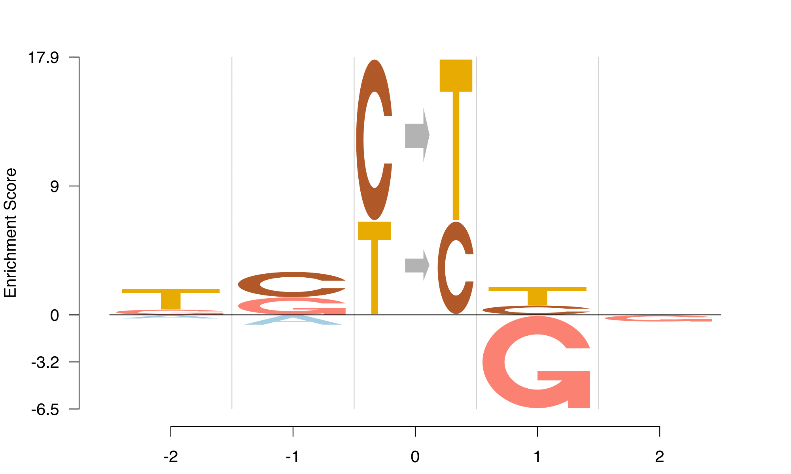
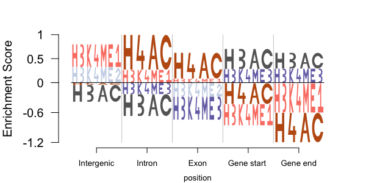

# Logolas

Logolas is an R package for Enrichment Depletion Logo plots with
string symbols, that highlights both enrichment and depletion of symbols, as opposed
to standard logo plots, as in [seqLogo package](https://doi.org/doi:10.18129/B9.bioc.seqLogo),
that are biased towards highlighting enrichments. Logolas also generalizes logo
plots to use both characters and strings.

If you find a bug, please create an
[issue](https://github.com/kkdey/Logolas/issues).

This code has been tested in ...



## License

Copyright (c) 2018-2019, Kushal Dey.

All source code and software in this repository are made available
under the terms of the [GNU General Public
License](http://www.gnu.org/licenses/gpl.html). See the
[LICENSE](LICENSE) file for the full text of the license.

## Citing this work

If you find that this R package is useful for your work, please cite
our paper:

> Dey, K.K., Xie, D. and Stephens, M., 2017. *A new sequence logo plot
to highlight enrichment and depletion.* bioRxiv
[doi:10.1101/226597](https://doi.org/10.1101/226597).

## Quick Start

The most recent version of Logolas is available from Github using [devtools](http://www.r-pkg.org/pkg/devtools) R package.First, you would 
require to install the following Bioconductor packages.

```R
source("https://bioconductor.org/biocLite.R")
biocLite(c("Biostrings","BiocStyle","Biobase","seqLogo","ggseqlogo"))
```
Then install Logolas as follows 

```R
library(devtools)
install_github("kkdey/Logolas",build_vignettes = TRUE)
```
Once you have installed the package, load the package in R by entering

```R
library(Logolas)
```

To get an overview of the package, enter

```R
help(package = "Logolas")
```

Next, try creating a few plots using the `logomaker` function:

Create a standard Logo plot in Logolas, analogous to `seqLogo` and 
`ggseqLogo` R packages.

```R
sequence <- c("CTATTGT","CTCTTAT","CTATTAA","CTATTTA", "CTATTAT","CTTGAAT",
              "CTTAGAT","CTATTAA","CTATTTA","CTATTAT", "CTTTTAT","CTATAGT",
              "CTATTTT","CTTATAT","CTATATT","CTCATTT", "CTTATTT","CAATAGT",
              "CATTTGA","CTCTTAT","CTATTAT","CTTTTAT", "CTATAAT","CTTAGGT",
              "CTATTGT","CTCATGT","CTATAGT", "CTCGTTA","CTAGAAT","CAATGGT")
logomaker(sequence,type = "Logo")
```
             


The corresponding EDLogo plot highlights the depletion of T in the middle, not 
visually clear in the standard logo plot.

```R
logomaker(sequence, type = "EDLogo")
```


One can also apply EDLogo for amino acid motifs, marked by alphabets beyond A, C, G and T as in
DNA motifs.

We create an EDLogo plot on the amino acid sequences at N-Glycosylation sites, with a user specified
background `bg` chosen to be the median psoitional weight of an aminoa acid in the context around the
glycosylation site [data from Uniprotkb].

```R
data("N_Glycosyl_sequences")
bg <- apply(N_Glycosyl_sequences, 1, function(x) return(median(x)))
bg <- bg/sum(bg)
logomaker(N_Glycosyl_sequences, type = "EDLogo", bg=bg)
```



EDLogo highlights the motif Asn (N) -X- Ser (S)/Thr (T) -X motif at the center where X is depleted for the amino acid Pro (P).

Logolas allows the symbols in the logo plot to be a combination of strings and charcaters or be purely strings - examples of which are shown below

For a mutation signature (mismatch type at the center with flanking bases) example (data from [Shiraishi et al 2015](https://journals.plos.org/plosgenetics/article?id=10.1371/journal.pgen.1005657)).

```R
data(mutation_sig)
logomaker(mutation_sig, type = "EDLogo", color_type = "per_symbol",  color_seed = 2000)
```



EDLogo plot for the enrichment and depletion of histone marks in different parts of the genome (data from [Koch et al 2007](https://www.ncbi.nlm.nih.gov/pubmed/17567990)).

```R
data(histone_marks)
logomaker(histone_marks$mat, bg = histone_marks$bgmat, type = "EDLogo")
```



Finally, please walk through some more detailed examples in the
[vignette](vignettes/Logolas.Rmd):

```R
vignette("Logolas")
```

## Developer notes

This was the R command used to generate the vignette PDF file from the
R Markdown source:

```R
render("Logolas.Rmd",output_format="pdf_document")
```

## Credits

This software was developed by [Kushal Dey](https://github.com/kkdey), 
[Dongyue Xie](https://github.com/DongyueXie) and
[Matthew Stephens](http://stephenslab.uchicago.edu) at the University
of Chicago. For any questions or comments, please contact Kushal Dey
at [kkdey@uchicago.edu](kkdey@uchicago.edu).

The authors would like to acknowledge Oliver Bembom, the author of the
`seqLogo` package which acted as an inspiration and starting point for this 
software. The authors also thank Peter Carbonetto, Edward Wallace and John Blischak
for helpful discussions and feedback.
