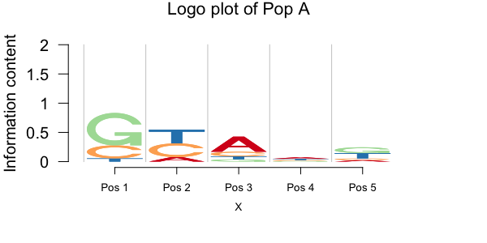
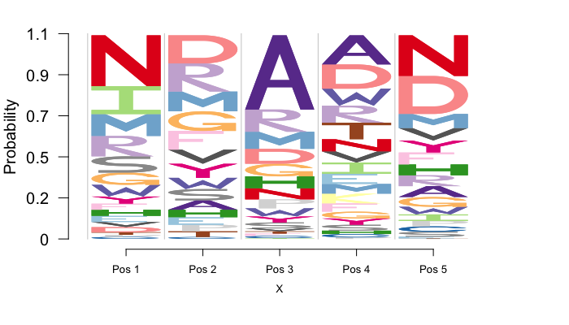
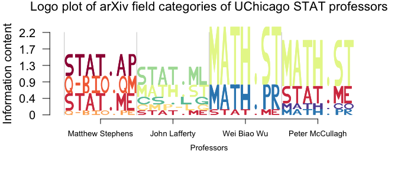
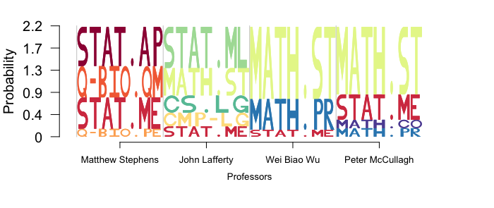
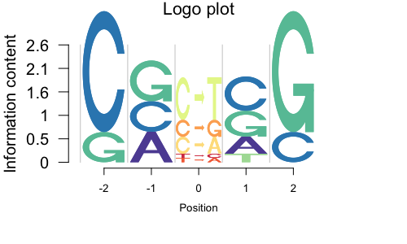
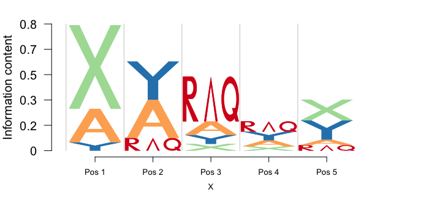

# Logolas

[](https://travis-ci.org/kkdey/Logolas)

A R package for Flexible logo plotting device for alphanumeric English symbols.

[Kushal K Dey](http://kkdey.github.io/),
[Matthew Stephens](http://stephenslab.uchicago.edu/)

## Introduction

Logolas requires the CRAN-R packages `grid`, `gridExtra` and `ggplot2`. Also the package builds on the template set by the Bioconductor package `seqLogo` which was aimed at displaying A, C, G, T sequence logo motifs. 
In some sense, this package may be considered a more flexible extension of the 'seqLogo' package.

## Installation

The package will be soon put on CRAN. As of now, you can install the developmental version from Github

```
library(devtools)
install_github('kkdey/Logolas')
```

Then load the package with:

```
library(Logolas)
```

## Application of Logolas - sequence motif example

In Logolas, you would only need a data frame or a matrix of counts of
the number of times each logo appeared in each block.

We first use Logolas for a simple example of sequence motif logo plots, that mimics what `seqLogo` does, with the addition that now there is more flexibility in designing and playing around with the logo structure.

```
counts_mat <- rbind(c(0, 10, 100, 60, 20),
                    c(40, 30, 30, 35, 20),
                    c(100, 0, 15, 25, 75),
                    c(10, 30, 20, 50, 70)
)

colnames(counts_mat) <- c("Pos 1", "Pos 2", "Pos 3", "Pos 4", "Pos 5")
rownames(counts_mat) <- c("A", "C", "G", "T")
counts_mat
```

The logo plots with normalized heights can be plotted as follows 

```
logomaker(counts_mat,
          cols= RColorBrewer::brewer.pal(dim(counts_mat)[1],
          name ="Spectral"),
          frame_width = 1,
          ic.scale = FALSE)
```


The logo plot with un-normalized heights

```
logomaker(counts_mat,
          cols= RColorBrewer::brewer.pal(dim(counts_mat)[1],
          name = "Spectral"),
          frame_width = 1,
          yscale_change = FALSE,
          pop_name = "Pop A")
```




Looks like the Y-axis does not adjust for the data, one can do that as follows (which is the default).

```
logomaker(counts_mat,
          cols= RColorBrewer::brewer.pal(dim(counts_mat)[1],
          name = "Spectral"),
          frame_width = 1)
```


## Application of Logolas - protein motif example

Our package is flexible to use on protein motif data as well. 

```
counts_mat <- rbind(c(0, 10, 100, 60, 20),
                    c(40, 30, 30, 35, 20),
                    c(100, 0, 15, 25, 75),
                    c(10, 30, 20, 50, 70),
                    c(4, 2, 3, 7, 10),
                    c(12, 8, 0, 21, 3),
                    rep(0, 5),
                    c(24, 21, 17, 14, 18),
                    c(12, 8, 16, 7, 20),
                    c(55, 0, 1, 23, 12),
                    rep(0,5),
                    c(rep(0,3), 20, 0),
                    c(43, 21, 23, 20, 26),
                    c(12, 20, 3, 17, 22),
                    c(4, 7, 12, 3, 10),
                    c(32, 12, 8, 12, 9),
                    c(5, 6, 3, 34, 1),
                    c(23, 12, 11, 35, 14),
                    c(14, 15, 8, 13, 22),
                    c(10, 15, 4, 23, 23))


rownames(counts_mat) <- c("A", "R", "N", "D",
                          "C", "E", "Q", "G",
                          "H", "I", "L", "K",
                          "M", "F", "P", "S",
                          "T", "W", "Y", "V")

colnames(counts_mat) <- c("Pos 1", "Pos 2", "Pos 3", "Pos 4", "Pos 5")

cols1 <- c(rev(RColorBrewer::brewer.pal(12, "Paired"))[c(3,4,7,8,11,12,5,6,9,10)],
           RColorBrewer::brewer.pal(12, "Set3")[c(1,2,5,8,9)],
           RColorBrewer::brewer.pal(9, "Set1")[c(9,7)],
           RColorBrewer::brewer.pal(8, "Dark2")[c(3,4,8)])

```

We then build the logo plots on this counts data.

```
logomaker(counts_mat,
          cols= cols1,
          frame_width = 1,
          ic.scale  = FALSE,
          yscale_change = TRUE)
```



## Application of Logolas - arXiv category logo 

Suppose we want to build a logo plot of the field categories of manuscipts submitted by authors on aRxiv. Here is a demo example on 4 Professors from
Statistics department, University of Chicago.

We first the counts data of number of publications for each category and
each of the 4 Professors (representing column blocks here).

```
library(aRxiv)
rec1 <- arxiv_search('au:"Matthew Stephens"', limit=50)
rec2 <- arxiv_search('au:"John Lafferty"', limit=50)
rec3 <- arxiv_search('au:"Wei Biao Wu"', limit=50)
rec4 <- arxiv_search('au:"Peter Mccullagh"', limit=50)

primary_categories_1 <- toupper(rec1$primary_category)
primary_categories_2 <- toupper(rec2$primary_category)
primary_categories_3 <- toupper(rec3$primary_category)
primary_categories_4 <- toupper(rec4$primary_category)

factor_levels <- unique(c(unique(primary_categories_1),
                   unique(primary_categories_2),
                   unique(primary_categories_3),
                   unique(primary_categories_4)))

primary_categories_1 <- factor(primary_categories_1, levels=factor_levels)
primary_categories_2 <- factor(primary_categories_2, levels=factor_levels)
primary_categories_3 <- factor(primary_categories_3, levels=factor_levels)
primary_categories_4 <- factor(primary_categories_4, levels=factor_levels)


tab_data <- cbind(table(primary_categories_1),
                  table(primary_categories_2),
                  table(primary_categories_3),
                  table(primary_categories_4))

colnames(tab_data) <- c("Matthew Stephens",
                        "John Lafferty",
                        "Wei Biao Wu",
                        "Peter McCullagh")

tab_data <- as.matrix(tab_data)
```
We apply the `logomaker` function to plot the logo plots.

```
logomaker(tab_data,
          cols= RColorBrewer::brewer.pal(dim(tab_data)[1],
          name = "Spectral"),
          frame_width = 1,
          ic.scale = TRUE,
          pop_name = "arXiv field categories of UChicago STAT professors",
          xlab = "Professors",
          ylab = "Information content")

```



```
logomaker(tab_data,
          cols= RColorBrewer::brewer.pal(dim(tab_data)[1],
          name = "Spectral"),
          frame_width = 1,
          ic.scale = FALSE,
          pop_name = "arXiv field categories of UChicago STAT professors",
          xlab = "Professors",
          ylab = "Information content")

```



## Application of Logolas - mutational profile

We build a mutational profile matrix with mutation at the center and the flanking bases on the either sides. 

```
library(seqLogo)
mFile <- system.file("Exfiles/pwm1", package="seqLogo")
m <- read.table(mFile)
p <- makePWM(m)
mat1 <- cbind(p@pwm[,c(3,4)], rep(0,4), p@pwm[,c(5,6)]);
colnames(mat1) <- c("-2", "-1", "0", "1", "2")
mat2 <- cbind(rep(0,6), rep(0,6), 
              c(0.5, 0.2, 0.2, 0.05, 0.05, 0),
              rep(0,6), rep(0,6))
rownames(mat2) <- c("C>T", "C>A", "C>G", 
                    "T>A", "T>C", "T>G")

table <- rbind(mat1, mat2)
```
Now we apply Logolas to build the mutational logo plot.

```
logomaker(table,
          cols= rev(RColorBrewer::brewer.pal(dim(table)[1],
          name = "Spectral")),
          frame_width = 1,
          ic.scale = TRUE,
          xlab = "Position",
          ylab = "Information content")

```




## Make your own logo

The biggest advantage of using this package is that an user can build
his own atom logos (symbols, letters, punctuation, number) and add it to the set of logos already available in the default version of the package.

For example, if one wants to have the symbol Lambda as part of his logo,
he can create it as follows 

```
LAMBDAletter <- function(colfill="green"){
  
  x <- c(0.15, 0.5, 0.85, 0.75, 0.5, 0.25)
  y <- c(0, 1, 0, 0, 0.8, 0)
  
  fill <- colfill
  id <- rep(1, length(x))
  
  ll <- list("x"= x,
             "y"= y,
             "id" = id,
             "fill" = fill)
  return(ll)
}
```

Do make sure, your function name is of the form `*letter"` where you can be creative with the `"*"` part. Also make sure the name you put must be in uppercase letters. You can check if the symbol plot looks like a
lambda or not. 

```
lambda <- LAMBDAletter()
grid::grid.newpage()
grid::pushViewport(grid::viewport(x=0.5,y=0.5,width=1, height=1,
                                  clip=TRUE))
grid::grid.polygon(lambda$x, lambda$y,
                     default.unit="native",
                     id=lambda$id,
                     gp=grid::gpar(fill=lambda$fill,
                                   lwd=10))
  
```


Okay, once you are happy with the shape of the symbol, you can add it to
the mix of all other symbols using the following command.

```
makemylogo("AC>EF/LAMBDA/W35", 
            addlogos="LAMBDA", 
            addlogos_text="LAMBDA", 
            plot=TRUE)
```


Note that e put `lambda` inside "/.../" to make sure that the function reads it as a new symbol and not general English alphabets or numbers. Once you run this, you should see the symbol as follows 

This confirms that the symbol has been read into the mix, and now it can be used for stacking logo symbols under the `logomaker()` functionality.


```
counts_mat <- rbind(c(0, 10, 100, 60, 20),
                    c(40, 30, 30, 35, 20),
                    c(100, 0, 15, 25, 75),
                    c(10, 30, 20, 50, 70)
)

colnames(counts_mat) <- c("Pos 1", "Pos 2", "Pos 3", "Pos 4", "Pos 5")
rownames(counts_mat) <- c("R/LAMBDA/Q", "A", "X", "Y")
counts_mat
```

LAMBDA symbol is added under `addlogos` and `addlogos_text` options for the `logomaker` mix of symbols.

```
logomaker(counts_mat,
          cols= RColorBrewer::brewer.pal(dim(counts_mat)[1],
          name = "Spectral"),
          frame_width = 1,
          addlogos="LAMBDA",
          addlogos_text="LAMBDA")
          
```



## Licenses

The Logolas package is distributed under [GPL - General Public License (>= 2)]

## Contact

For any questions or comments, please contact [kkdey@uchicago.edu](kkdey@uchicago.edu)

## Acknowledgements


