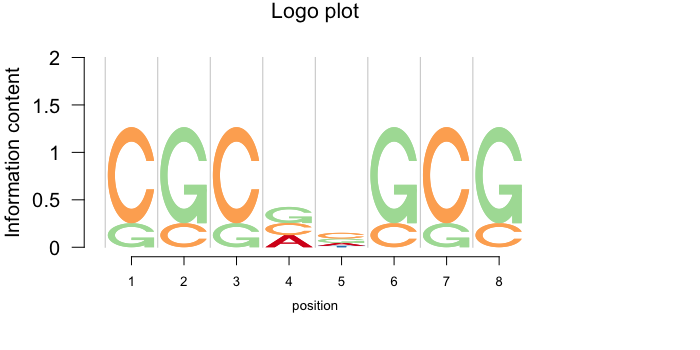
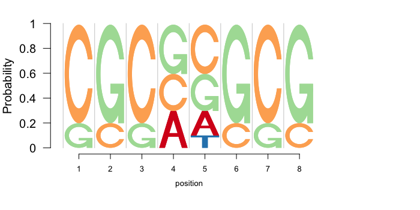
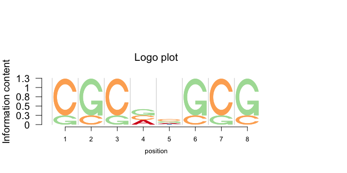

# Logolas

[](https://travis-ci.org/kkdey/Logolas)

A R package for Flexible logo plotting device for alphanumeric English symbols.

[Kushal K Dey](http://kkdey.github.io/),
[Matthew Stephens](http://stephenslab.uchicago.edu/)

## Introduction

Logolas requires the CRAN-R packages `grid`, `gridExtra` and `ggplot2`. Also the package builds on the template set by the Bioconductor package `seqLogo` which was aimed at displaying A, C, G, T sequence logo motifs. 
In some sense, this package may be considered a more flexible extension of the 'seqLogo' package.

## Installation

The package will be soon put on CRAN. As of now, you can install the developmental version from Github

```
library(devtools)
install_github('kkdey/Logolas')
```

Then load the package with:

```
library(Logolas)
```

## Application of Logolas - sequence motif example

For sequence motif design problems, `seqLogo` is a standard package that is used and it is very easy to use. Here is an example from the vignette of the `seqLogo` package.

```
library(seqLogo)
mFile <- system.file("Exfiles/pwm1", package="seqLogo")
m <- read.table(mFile)
p <- makePWM(m)
seqLogo(p)
```


`seqLogo` uses the `makePWM` function to convert the matrix into a class "pwm" object by assigning the base information to the rows. To use our package, the user on the other hand would just need to set the row names to the base letters and the column names to the position index as follows.
This would be more flexible when the user wants to play around with the order of the row names and change the column names.

```
mat <- m
rownames(mat) <- c("A", "C", "G", "T")
colnames(mat) <- 1:8

logomaker(mat,
          cols= RColorBrewer::brewer.pal(dim(mat)[1],
          name ="Spectral"),
          frame_width = 1,
          ic.scale = TRUE,
          yscale_change=FALSE,
          xlab="position")
```



Just as in `seqLogo` , `Logolas` too has an  `ic.scale`  option to determine if the heights of the bars should be same or should be determined by the information criterion. 

```
logomaker(mat,
          cols= RColorBrewer::brewer.pal(dim(mat)[1],
          name ="Spectral"),
          frame_width = 1,
          ic.scale = FALSE,
          yscale_change=FALSE,
          xlab="position")
```



In addition, the user can use the `yscale_change` option which adjusts for the scale of Y axis as per data and blows up the logo plot, making it easier to visualize.

```
logomaker(mat,
          cols= RColorBrewer::brewer.pal(dim(mat)[1],
          name ="Spectral"),
          frame_width = 1,
          ic.scale = TRUE,
          yscale_change=TRUE,
          xlab="position")
```



Besides, Logolas also lets you play with the colors of the symbols, choose your own `ic` function that can be used to determine the heights of the stacks, set titles, x-labels, y-labels and axis names as per the user choice and also choose the relative width of each column in the logo stack, the kind of flexibility one does not get with `seqLogo` package.

`seqLogo` is constrained to only logos for $A$, $C$, $G$ and $T$, but `Logolas` has a much wider mix of symbols or logos, encompassing all English uppercase alphabets, numbers, punctuation marks and all combinations numbers, alphabets and punctuations. Additionally, it lets the user to set new symbols and add them to the mix. All this makes `Logolas` a pretty generic logo building tool that can be applied in many applications. A few of those applications are provided below. 


## Application of Logolas - protein motif example

Our package is flexible to use on protein motif data as well. For protein motifs, insead of base symbols, we have symbols for $20$ amino acids, each of which is assigned one English alphabet. A demo example of that is provided below.

```
counts_mat <- rbind(c(0, 0, 100, 1, 2),
                    c(4, 3, 30, 35, 2),
                    c(100, 0, 10, 2, 7),
                    rep(0,5),
                    c(4, 2, 3, 7, 70),
                    c(1, 8, 0, 60, 3),
                    rep(0, 5),
                    c(4, 2, 100, 1, 1),
                    c(12, 8, 16, 7, 20),
                    c(55, 0, 1, 0, 12),
                    rep(0,5),
                    c(rep(0,3), 20, 0),
                    rep(0,5),
                    c(0, 0, 30, 0, 22),
                    c(1, 0, 12, 3, 10),
                    rep(0,5),
                    c(0, 1, 0, 34, 1),
                    c(0, 1, 12, 35, 1),
                    c(0, 30, 1, 10, 2),
                    c(0, 1, 4, 100, 2))


rownames(counts_mat) <- c("A", "R", "N", "D",
                          "C", "E", "Q", "G",
                          "H", "I", "L", "K",
                          "M", "F", "P", "S",
                          "T", "W", "Y", "V")

colnames(counts_mat) <- c("Pos 1", "Pos 2", "Pos 3", "Pos 4", "Pos 5")

cols1 <- c(rev(RColorBrewer::brewer.pal(12, "Paired"))[c(3,4,7,8,11,12,5,6,9,10)],
           RColorBrewer::brewer.pal(12, "Set3")[c(1,2,5,8,9)],
           RColorBrewer::brewer.pal(9, "Set1")[c(9,7)],
           RColorBrewer::brewer.pal(8, "Dark2")[c(3,4,8)])

```

We then build the logo plots on this counts data.

```
logomaker(counts_mat,
          cols= cols1,
          frame_width = 1,
          ic.scale  = FALSE,
          yscale_change = FALSE)
```


## Application of Logolas - arXiv category logo 

Suppose we want to build a logo plot of the field categories of manuscipts submitted by authors on aRxiv. Here is a demo example on 4 Professors from
Statistics department, University of Chicago where I come from. Note here the field categories are a combination of numbers and alphabets and not just a single alphabet as in the examples above. `Logolas` can be easily used even in such cases, with the same syntax structure as before.

We generate the counts data of number of publications for each category for each of the 4 Professors (representing column blocks here).

```
library(aRxiv)
rec1 <- arxiv_search('au:"Matthew Stephens"', limit=50)
rec2 <- arxiv_search('au:"John Lafferty"', limit=50)
rec3 <- arxiv_search('au:"Wei Biao Wu"', limit=50)
rec4 <- arxiv_search('au:"Peter Mccullagh"', limit=50)

primary_categories_1 <- toupper(rec1$primary_category)
primary_categories_2 <- toupper(rec2$primary_category)
primary_categories_3 <- toupper(rec3$primary_category)
primary_categories_4 <- toupper(rec4$primary_category)

factor_levels <- unique(c(unique(primary_categories_1),
                   unique(primary_categories_2),
                   unique(primary_categories_3),
                   unique(primary_categories_4)))

primary_categories_1 <- factor(primary_categories_1, levels=factor_levels)
primary_categories_2 <- factor(primary_categories_2, levels=factor_levels)
primary_categories_3 <- factor(primary_categories_3, levels=factor_levels)
primary_categories_4 <- factor(primary_categories_4, levels=factor_levels)


tab_data <- cbind(table(primary_categories_1),
                  table(primary_categories_2),
                  table(primary_categories_3),
                  table(primary_categories_4))

colnames(tab_data) <- c("Matthew Stephens",
                        "John Lafferty",
                        "Wei Biao Wu",
                        "Peter McCullagh")

tab_data <- as.matrix(tab_data)
```
We apply the `logomaker` function to plot the logo plots.

```
logomaker(tab_data,
          cols= RColorBrewer::brewer.pal(dim(tab_data)[1],
          name = "Spectral"),
          frame_width = 1,
          ic.scale = TRUE,
          pop_name = "arXiv field categories of UChicago STAT professors",
          xlab = "Professors",
          ylab = "Information content")

```


```
logomaker(tab_data,
          cols= RColorBrewer::brewer.pal(dim(tab_data)[1],
          name = "Spectral"),
          frame_width = 1,
          ic.scale = FALSE,
          pop_name = "arXiv field categories of UChicago STAT professors",
          xlab = "Professors",
          ylab = "Information content")

```


## Application of Logolas - mutational profile

Sometimes a symbol or logo might be even more complex. For example, one may want to represent mutational profile as a logo plot, with the base substitution at the center and the flanking base information to the left and right of the substitution. For the substitution, one may want to use symbols like $ C -> T$ etc. `Logolas` is flexible enough to mix symbols with arrow signs (among other signs) and it is very easy to define the logo as $C>T$, $A>G$ etc and $>$ is interpreted as a right arrow (Similarly $<$ is interpreted as left arrow). Check the example below

```
library(seqLogo)
mFile <- system.file("Exfiles/pwm1", package="seqLogo")
m <- read.table(mFile)
p <- makePWM(m)
mat1 <- cbind(p@pwm[,c(3,4)], rep(0,4), p@pwm[,c(5,6)]);
colnames(mat1) <- c("-2", "-1", "0", "1", "2")
mat2 <- cbind(rep(0,6), rep(0,6), 
              c(0.5, 0.2, 0.2, 0.05, 0.05, 0),
              rep(0,6), rep(0,6))
rownames(mat2) <- c("C>T", "C>A", "C>G", 
                    "T>A", "T>C", "T>G")

table <- rbind(mat1, mat2)
```
Now we apply Logolas to build the mutational logo plot.

```
logomaker(table,
          cols= rev(RColorBrewer::brewer.pal(dim(table)[1],
          name = "Spectral")),
          frame_width = 1,
          ic.scale = TRUE,
          yscale_change=TRUE,
          xlab = "Position",
          ylab = "Information content")

```


## Make your own logo

The biggest advantage of using this package is that an user can build
his own atom logos (symbols, letters, punctuation, number) and add it to the set of logos already available in the default version of the package.

For example, if one wants to have the symbol Lambda as part of his logo,
he can create it as follows 

```
LAMBDAletter <- function(colfill="green"){
  
  x <- c(0.15, 0.5, 0.85, 0.75, 0.5, 0.25)
  y <- c(0, 1, 0, 0, 0.8, 0)
  
  fill <- colfill
  id <- rep(1, length(x))
  
  ll <- list("x"= x,
             "y"= y,
             "id" = id,
             "fill" = fill)
  return(ll)
}
```

Do make sure, your function name is of the form `*letter"` where you can be creative with the `"*"` part. Also make sure the name you put must be in uppercase letters. You can check if the symbol plot looks like a
lambda or not. 

```
lambda <- LAMBDAletter()
grid::grid.newpage()
grid::pushViewport(grid::viewport(x=0.5,y=0.5,width=1, height=1,
                                  clip=TRUE))
grid::grid.polygon(lambda$x, lambda$y,
                     default.unit="native",
                     id=lambda$id,
                     gp=grid::gpar(fill=lambda$fill,
                                   lwd=10))
  
```


Okay, once you are happy with the shape of the symbol, you can add it to
the mix of all other symbols using the following command.

```
makemylogo("AC>EF/LAMBDA/W35", 
            addlogos="LAMBDA", 
            addlogos_text="LAMBDA", 
            plot=TRUE)
```


Note that e put `lambda` inside "/.../" to make sure that the function reads it as a new symbol and not general English alphabets or numbers. Once you run this, you should see the symbol as follows 

This confirms that the symbol has been read into the mix, and now it can be used for stacking logo symbols under the `logomaker()` functionality.


```
counts_mat <- rbind(c(0, 10, 100, 60, 20),
                    c(40, 30, 30, 35, 20),
                    c(100, 0, 15, 25, 75),
                    c(10, 30, 20, 50, 70)
)

colnames(counts_mat) <- c("Pos 1", "Pos 2", "Pos 3", "Pos 4", "Pos 5")
rownames(counts_mat) <- c("R/LAMBDA/Q", "A", "X", "Y")
counts_mat
```

LAMBDA symbol is added under `addlogos` and `addlogos_text` options for the `logomaker` mix of symbols.

```
logomaker(counts_mat,
          cols= RColorBrewer::brewer.pal(dim(counts_mat)[1],
          name = "Spectral"),
          frame_width = 1,
          addlogos="LAMBDA",
          addlogos_text="LAMBDA")
          
```


## Licenses

The Logolas package is distributed under [GPL - General Public License (>= 2)]

## Contact

For any questions or comments, please contact [kkdey@uchicago.edu](kkdey@uchicago.edu)

## Acknowledgements

We would like to acknowledge Oliver Bembom, the author of `seqLogo` for acting as an inspiration and giving us the base through his awesome package, on which we developed this software.


